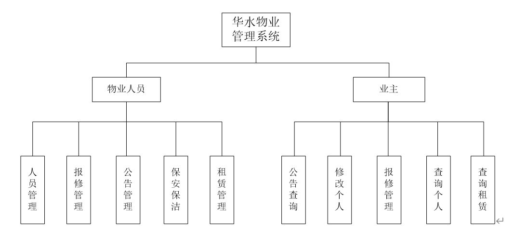
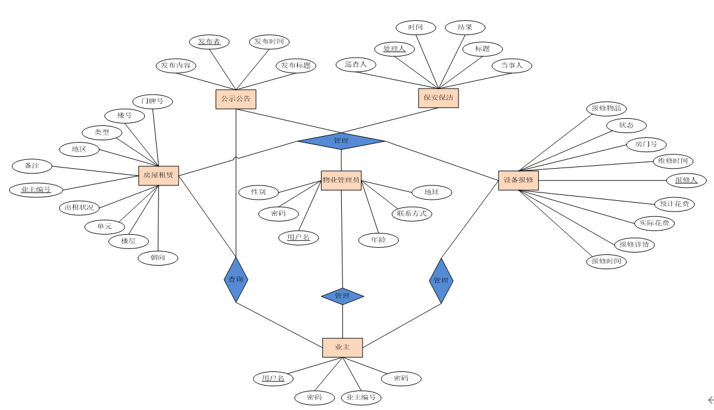
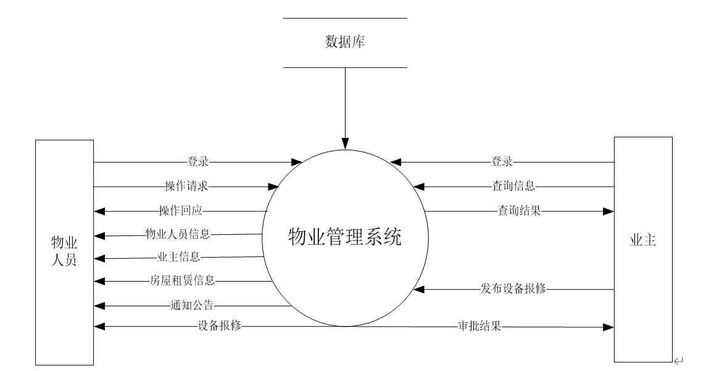
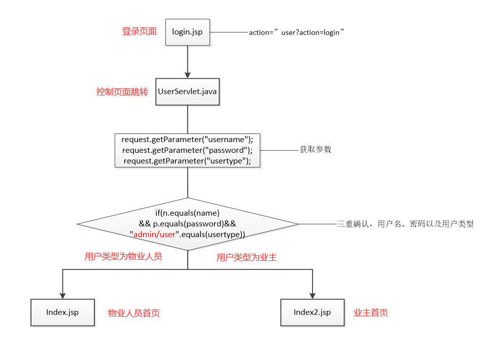
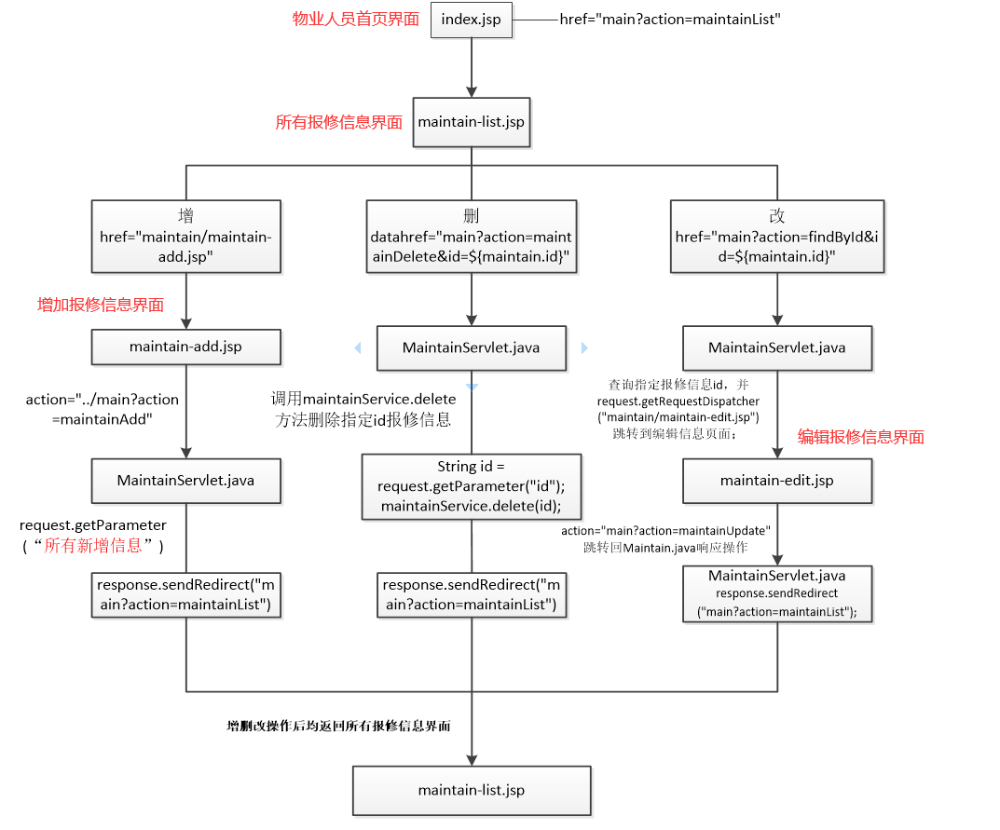
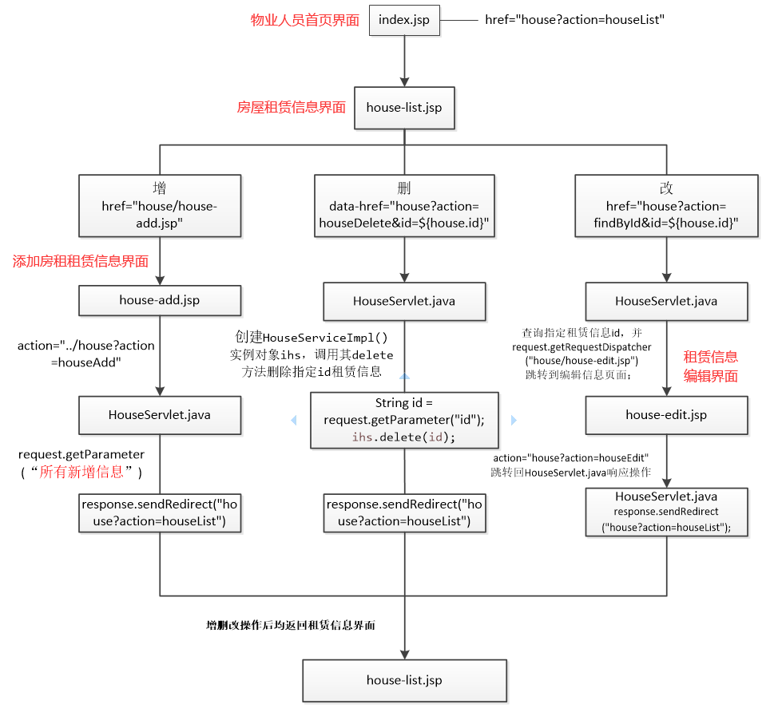
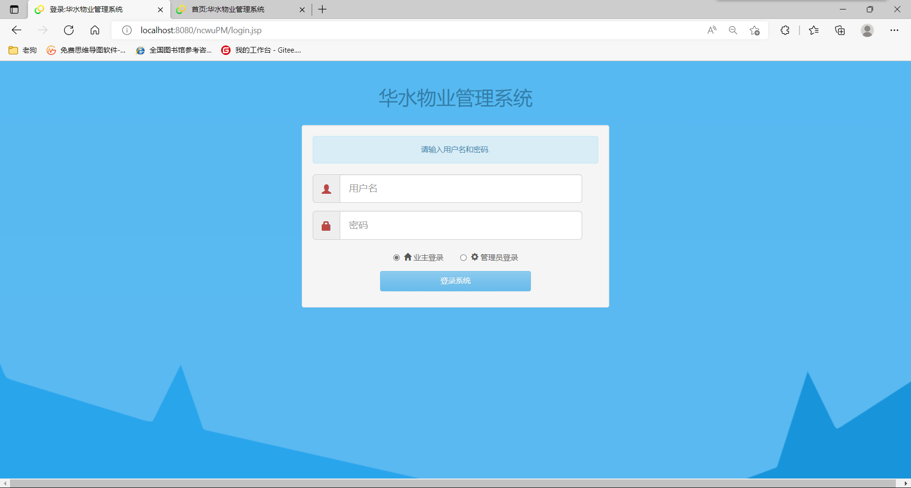
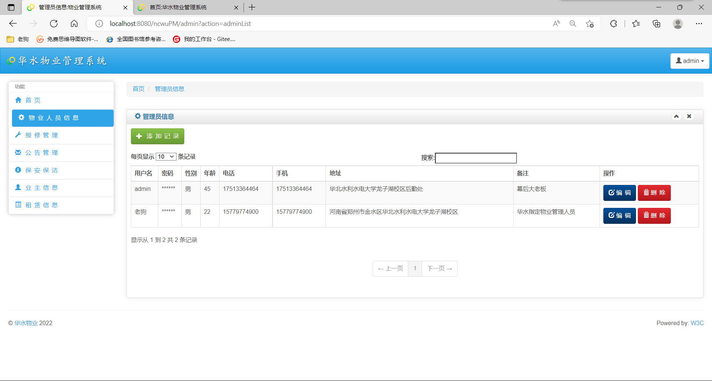

# Ncwu_PM
## 校园物业管理系统
本次开发的物业管理系统设计两类用户，分别是物业管理人员和业主，其中业主又分为宿舍长和家属区业主，他们通过登录系统进入不同界面执行各自权限范围内的事项。

对于物业管理人员，通过输入用户名和密码进行登录，登录后可进行物业人员信息管理、报修管理、公告管理、保安保洁督查、业主信息管理以及租赁信息管理，以上六个模块的功能均可实现增删改查；

对于业主（家属院业主以及宿舍长），通过输入用户名和密码进行登录，登录后可进行公告查询、修改个人信息、报修管理、查询个人信息、查询租赁信息（家属院业主可通过物业人员发布租赁信息）；

在数据库中，共包含物业人员信息表、业主信息表、房屋租赁信息表、检查保安保洁信息表、报修信息表和发布公告信息表；通过上述表实现对系统所需要的信息进行存储，也便于增删改查的操作。
### 功能层次图

### 开发环境
* Visio画图工具：制作E-R实体关系图，数据流图和数据字典等图示；
* MySQL8.0：创建数据库，数据表进行后台存储；
* eclipse：编译java web程序；
* tomcat9.0：web应用服务器。
## 数据库设计
### E-R图

### 顶层数据流图

## 详细设计
### 登录模块

### 报修管理模块

### 租赁信息模块

## 实现效果
### 登录

### 主界面

